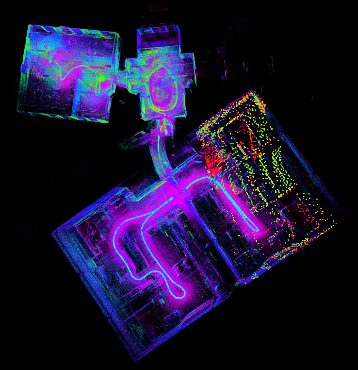
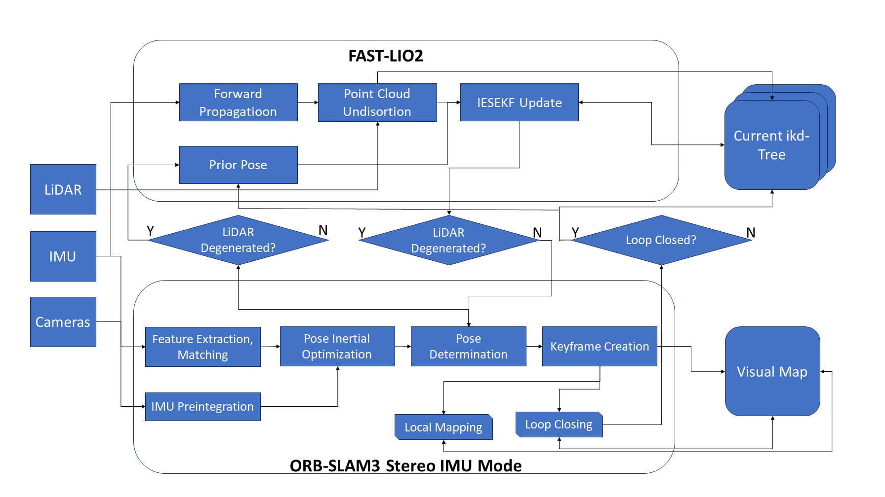
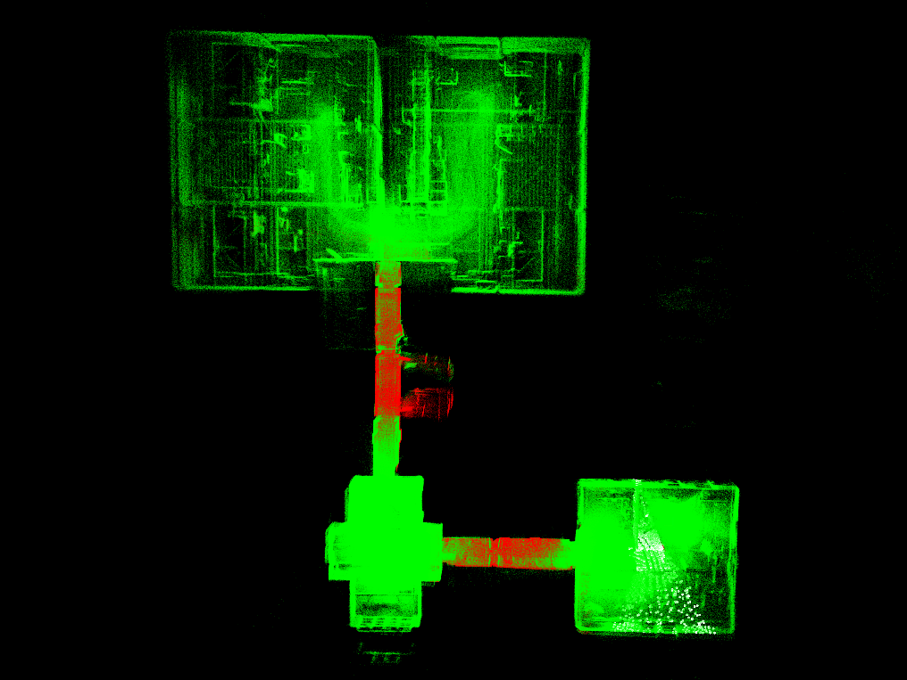
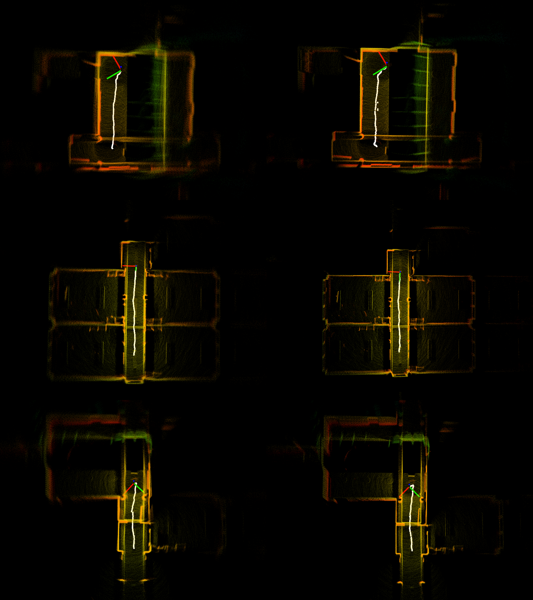
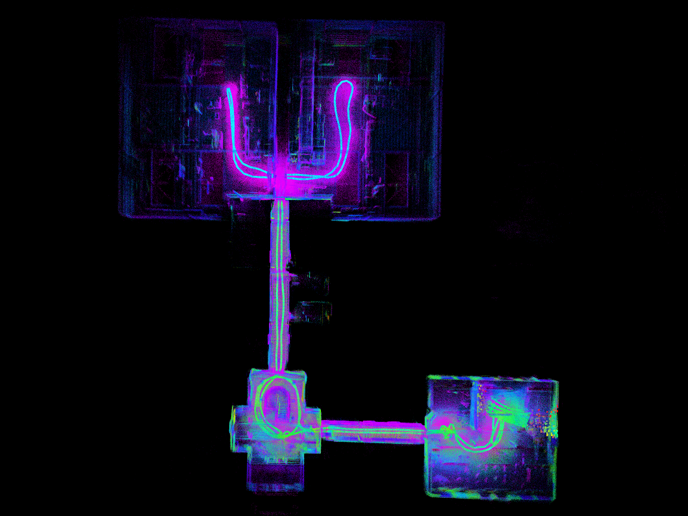
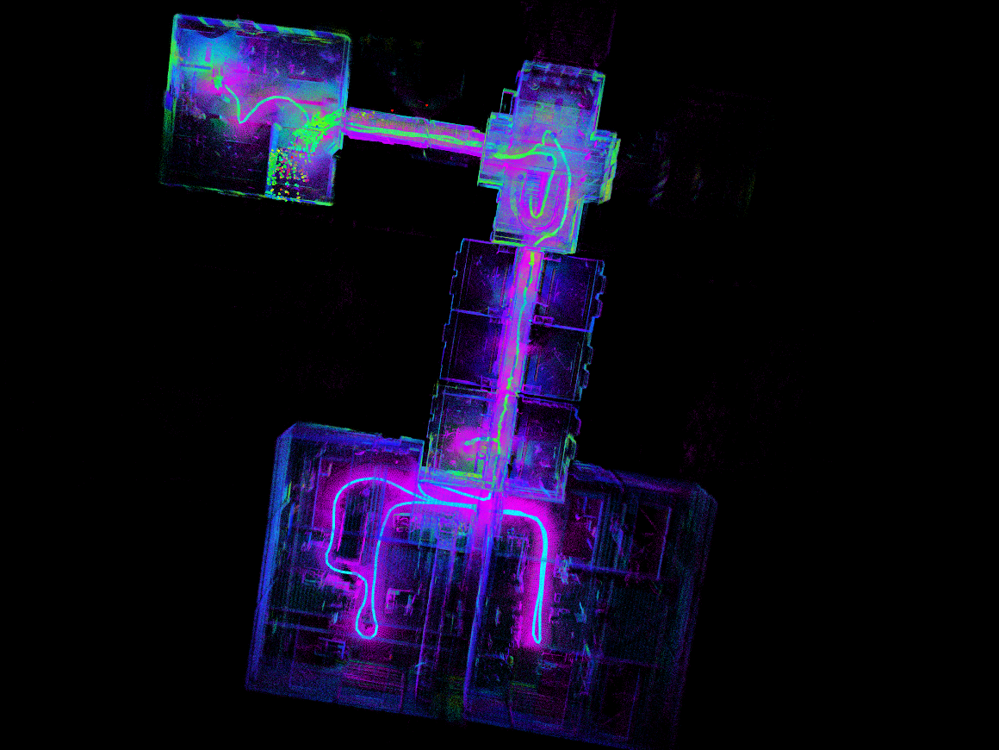

# Hybrid SLAM Framework: ORB-SLAM3 + FAST-LIO2

This repository presents the implementation of my Master's thesis project — a hybrid SLAM system that integrates the complementary strengths of [ORB-SLAM3](https://github.com/UZ-SLAMLab/ORB_SLAM3) and [FAST-LIO2](https://github.com/hku-mars/FAST_LIO2). The fusion ensures robust state estimation and accurate mapping using **camera**, **LiDAR**, and **IMU** data.

---
## 💡 Motivation

SLAM systems based solely on either visual or LiDAR data face critical limitations:

- **ORB-SLAM3** struggles under:
  - High-speed motion (visual tracking loss)
  - Motion blur
  - Low-texture environments
  - Very sparse point map
- **FAST-LIO2** suffers when:
  - The environment lacks rich geometric features
  - LiDAR returns become degenerate or sparse


<div align="center">
  
  <p><em>Figure 1: FAST-LIO2 failed due to LiDAR degeneration in long corridors.</em></p>
</div>

To overcome these challenges, this hybrid framework combines the **visual robustness of ORB-SLAM3** with the **geometric precision of FAST-LIO2**, enabling accurate and reliable localization in a wide range of environments.

## 🔧 System Overview

### 🧠 Concept Highlights

1. **System-Level Fusion (Not Raw Measurement Fusion)**  
   - Two independent subsystems:
     - **FAST-LIO2**: LiDAR-Inertial Odometry (LIO)
     - **ORB-SLAM3**: Visual-Inertial SLAM (VISLAM)
   - Estimation results from each subsystem are fused, not raw sensor data.

2. **Short-Term Mutual Assistance**
   - When the LiDAR environment is **non-degenerated**, FAST-LIO2 enhances ORB-SLAM3’s mapping.
   - When LiDAR scans are **degenerated**, ORB-SLAM3 helps update FAST-LIO2’s IESEKF state.

3. **Mid- and Long-Term Data Association**
   - **Mid-Term**: Additional LiDAR association logic improves map continuity.
   - **Long-Term**: ORB-SLAM3's loop closing ensures global consistency.

---

## 📷 Visualizations

### 🔁 System Overview
<div align="center">
  
  <p><em>Figure 2: System Overview.</em></p>
</div>

### 📍 Degeneracy based mutual assistance fusion strategy with multi ikd-tree
<div align="center">
  
  <p><em>Figure 3: Degeneracy based sensor fusion. Green indicates non-degeneracy, red indicates LiDAR degeneracy.</em></p>
</div>

### 📍 LiDAR mid term data association using BALM
<div align="center">
  
  <p><em>Figure 4: The mid term LiDAR association is carried out using BALM to eliminate accumulated error.</em></p>
</div>

### 🗺️ Loop Closing and Mapping Result

<div align="center">
  
  <p><em>Figure 5: After a long journey, the system is able to perform loop closing and deliver precise mapping result.</em></p>
</div>challengingdataset

<div align="center">
  
  <p><em>Figure 6: This is the consistent and precise mapping result of a challenging dataset where the agent started from a office and transversed long corridors at ground floor and the second floor and visited production halls.</em></p>
</div>
---

## 📦 Dependencies

- ROS (Melodic / Noetic)
- C++14
- Eigen, OpenCV, Pangolin, PCL
- Livox SDK (for FAST-LIO2)
- DBoW2, ORB-SLAM3 dependencies

---

## 🚀 Launch Instructions

```bash
cd ~/catkin_HYBRID_SLAM
catkin_make
source devel/setup.bash
roslaunch hybrid_fusion hybrid_slam.launch
```

## 📜 License
This code is released for academic use only. Refer to the individual licenses of ORB-SLAM3 and FAST-LIO2.

## 📫 Contact
Yumao Liu
Master Thesis – TU Darmstadt
Email: liuyumao_sid@outlook.com
GitHub: LiuYMUNI
